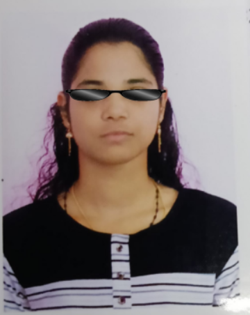

# Workshop--1-Adding-Sunglasses-to-Your-Passport-Photo-Using-OpenCV
## Aim

To develop an image processing application using Python and OpenCV that adds sunglasses to a face image by overlaying a transparent sunglass image onto the eye region.

---

## Software Required

* Python 3.x
* OpenCV (`cv2`)
* NumPy
* Matplotlib
* Jupyter Notebook / Google Colab

---

## Algorithm

1. Import the required libraries such as OpenCV, NumPy, and Matplotlib.
2. Load the face image.
3. Load the sunglass PNG image with an alpha (transparent) channel.
4. Resize the sunglass image to fit the face image properly.
5. Separate the RGB and alpha channels of the sunglass image.
6. Select the Region of Interest (ROI) on the face where the sunglasses should be placed.
7. Resize the sunglass image according to the ROI size.
8. Blend the sunglass image with the face image using masking and alpha blending techniques.
9. Display the final output image with sunglasses.

---
## Program

```
import cv2
import matplotlib.pyplot as plt

face = cv2.imread("starbiya.jpeg")
glass = cv2.imread("sunglass.png")

gray = cv2.cvtColor(face, cv2.COLOR_BGR2GRAY)

face_cascade = cv2.CascadeClassifier(
    cv2.data.haarcascades + "haarcascade_frontalface_default.xml"
)

faces = face_cascade.detectMultiScale(gray, 1.1, 5)

for (x, y, w, h) in faces:

    glass_width = w
    glass_height = int(h * 0.35)

    glass_resized = cv2.resize(glass, (glass_width, glass_height))

    y_pos = y + int(h * 0.22)
    x_pos = x

    roi = face[y_pos:y_pos+glass_height,
               x_pos:x_pos+glass_width]

    gray_glass = cv2.cvtColor(glass_resized, cv2.COLOR_BGR2GRAY)

    _, mask = cv2.threshold(
        gray_glass, 220, 255, cv2.THRESH_BINARY_INV
    )

    mask_inv = cv2.bitwise_not(mask)

    bg = cv2.bitwise_and(roi, roi, mask=mask_inv)
    fg = cv2.bitwise_and(glass_resized, glass_resized, mask=mask)

    dst = cv2.add(bg, fg)

    face[y_pos:y_pos+glass_height,
         x_pos:x_pos+glass_width] = dst

plt.imshow(cv2.cvtColor(face, cv2.COLOR_BGR2RGB))
plt.axis("off")
plt.show()

cv2.imwrite("final_output.png", face)
```
## Output



## Result

The program successfully detects the selected face region and overlays the sunglass image onto the face, producing a realistic image of a person wearing sunglasses using image processing techniques in OpenCV.